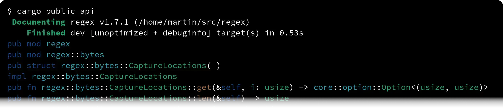

# cargo-public-api

List and diff the public API of Rust library crates between releases and commits. Detect breaking API changes and semver violations via CI or a CLI. Relies on and automatically builds [rustdoc JSON](https://github.com/rust-lang/rust/issues/76578), for which a recent version of the Rust nightly toolchain must be installed.

# Installation

Install the `cargo public-api` subcommand with a recent regular **stable** Rust toolchain:

```sh
cargo +stable install cargo-public-api --locked
```

Ensure **nightly-2024-09-10** or later is installed (does not need to be the active toolchain) so `cargo public-api` can build rustdoc JSON for you:

```sh
rustup install nightly --profile minimal
```

# Usage

## List the Public API

This example lists the public API of the `regex` crate. First we clone the repo:

```sh
git clone https://github.com/rust-lang/regex ; cd regex
```

Now we can list the public API of `regex` by running

```sh
cargo public-api
```

which will print the public API of `regex` with one line per public item in the API:



## Diff the Public API

### … Against a Specific Published Version

To diff the public API of the `regex` crate in the **current directory** against  **published version 1.6.0** on [crates.io](https://crates.io/crates/regex/1.6.0):

```sh
cargo public-api diff 1.6.0
```


### … Against the Latest Published Version

```sh
cargo public-api diff latest
```

### … Between Git Commits

```sh
cargo public-api diff ref1..ref2
```

### … as a CI Check

<!-- Keep this section in sync with ./public-api/README.md#public-api-surface-test-in-ci -->

With a regular `cargo test` that you run in CI you will be able to
* prevent accidental changes to your public API
* review the public API diff of deliberate changes

First add the latest versions of the recommended libraries to your `[dev-dependencies]`:

```sh
cargo add --dev \
    rustup-toolchain \
    rustdoc-json \
    public-api \
    expect-test
```

Then add the following test to your project. As the author of the below test code, I hereby associate it with [CC0](https://creativecommons.org/publicdomain/zero/1.0/) and to the extent possible under law waive all copyright and related or neighboring rights to it:

<!-- Keep this code in sync with the code in ./rustup-toolchain/tests/rustup-toolchain-lib-tests.rs -->
```rust
#[test]
fn public_api() {
    // Install a compatible nightly toolchain if it is missing
    rustup_toolchain::install(public_api::MINIMUM_NIGHTLY_RUST_VERSION).unwrap();

    // Build rustdoc JSON
    let rustdoc_json = rustdoc_json::Builder::default()
        .toolchain(public_api::MINIMUM_NIGHTLY_RUST_VERSION)
        .build()
        .unwrap();

    // Derive the public API from the rustdoc JSON
    let public_api = public_api::Builder::from_rustdoc_json(rustdoc_json)
        .build()
        .unwrap();

    // Assert that the public API looks correct
    expect_test::expect_file!["public-api.txt"].assert_eq(&public_api.to_string());
}
```

Before you run the test the first time you need to bless the current public API:

```sh
UPDATE_EXPECT=1 cargo test public_api
```

This creates a `tests/public-api.txt` file in your project that you `git add` together with your other project files. Whenever you change the public API, you need to bless it again with the above command. If you forget to bless, the test will fail, together with instructions on how to bless.

## Less Noisy Output

For completeness, items belonging to _Blanket Implementations_, _Auto Trait Implementations_, and _Auto Derived Implementations_, such as

 * `impl<T, U> Into<U> for T where U: From<T>`
 * `impl Sync for ...`
 * `impl Debug for ...` / `#[derive(Debug)]`

are included in the list of public items by default. Use

 * `--omit blanket-impls`
 * `--omit auto-trait-impls`
 * `--omit auto-derived-impls`

respectively to omit such items from the output to make it much less noisy:

```sh
cargo public-api --omit blanket-impls,auto-trait-impls,auto-derived-impls
```

For convenience you can also use `-s` (`--simplified`) to achieve the same thing. This is a shorter form of the above command:

```sh
cargo public-api -sss
```

# Compatibility Matrix

| Version          | Understands the rustdoc JSON output of  |
| ---------------- | --------------------------------------- |
| 0.38.x -         | nightly-2024-09-10 -                    |
| 0.37.x           | nightly-2024-07-05 — nightly-2024-09-09 |
| 0.35.x — 0.36.x  | nightly-2024-06-07 — nightly-2024-07-04 |
| 0.32.x — 0.34.x  | nightly-2023-08-25 — nightly-2024-06-06 |
| 0.30.x — 0.31.x  | nightly-2023-05-24 — nightly-2023-08-24 |
| earlier versions | see [here](https://github.com/cargo-public-api/cargo-public-api/blob/7056d59cd279610fc61cc9669be3840b0dd8273c/README.md#compatibility-matrix) |

# Changelog

See [CHANGELOG.md](./CHANGELOG.md).

# Contributing

See [CONTRIBUTING.md](./docs/CONTRIBUTING.md).

## Maintainers

- [Enselic](https://github.com/Enselic)
- [douweschulte](https://github.com/douweschulte)
- [Emilgardis](https://github.com/Emilgardis)
