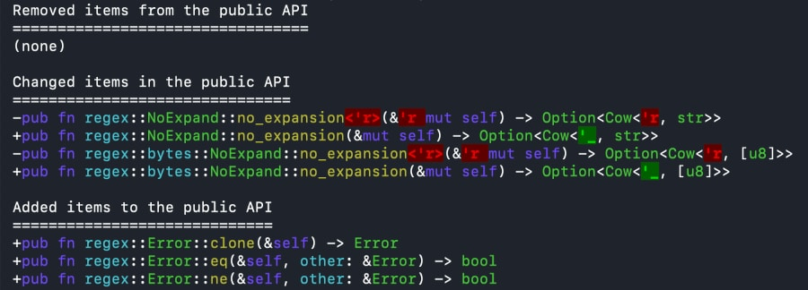

# cargo-public-api

List and diff the public API of Rust library crates between releases and commits. Detect breaking API changes and semver violations. Relies on and automatically builds [rustdoc JSON](https://github.com/rust-lang/rust/issues/76578), for which a recent version of the Rust nightly toolchain must be installed.

# Installation

```bash
# Install cargo-public-api with a recent regular stable Rust toolchain
cargo install cargo-public-api

# Ensure nightly-2023-01-04 or later is installed so cargo-public-api can build rustdoc JSON for you
rustup install nightly
```

# Usage

## List the Public API

This example lists the public API of the ubiquitous `regex` crate. First we clone the repo:

```bash
git clone https://github.com/rust-lang/regex
cd regex
```

Now we can list the public API of `regex` by running

```bash
cargo public-api
```

which will print the public API of `regex` with one line per public item in the API:


## Diff the Public API

To diff the API between say **0.2.2** and **0.2.3** of `regex`, use `diff 0.2.2..0.2.3` while standing in the git repo. Like this:

```bash
cargo public-api diff 0.2.2..0.2.3
```

and the API diff will be printed:



### … of Your Current Branch

When you make changes to your library you often want to make sure that you do not accidentally change the public API of your library, or that the API change you are making looks like you expect. For this use case, first git commit your work in progress, and then run

```bash
cargo public-api diff origin/main..your-current-branch
```

which will print the diff of your public API changes compared to `origin/main`.

### … as a CI Check

This tool can be put to good use in CI pipelines to e.g. help you make sure your public API is not unexpectedly changed. Please see [CI-EXAMPLES.md](./docs/CI-EXAMPLES.md) for CI job configuration examples and use cases.

### … Against Published Version

Before you `cargo publish` a new version of your crate, you can diff the public API of your local code against the public API of the version you last published. Use the `diff <VERSION>` syntax for that. Like this:

```bash
cargo public-api diff 0.2.2
```

## Expected Output

Output aims to be character-by-character identical to the textual parts of the regular `cargo doc` HTML output. For example, [this item](https://docs.rs/bat/0.20.0/bat/struct.PrettyPrinter.html#method.input_files) has the following textual representation in the rendered HTML:

```
pub fn input_files<I, P>(&mut self, paths: I) -> &mut Self
where
    I: IntoIterator<Item = P>,
    P: AsRef<Path>,
```

and `cargo public-api` represents this item in the following manner:

```
pub fn bat::PrettyPrinter::input_files<I, P>(&mut self, paths: I) -> &mut Self where I: IntoIterator<Item = P>, P: AsRef<Path>
```

If we normalize by removing newline characters and adding some whitespace padding to get the alignment right for side-by-side comparison, we can see that they are exactly the same, except an irrelevant trailing comma:

```
pub fn                     input_files<I, P>(&mut self, paths: I) -> &mut Self where I: IntoIterator<Item = P>, P: AsRef<Path>,
pub fn bat::PrettyPrinter::input_files<I, P>(&mut self, paths: I) -> &mut Self where I: IntoIterator<Item = P>, P: AsRef<Path>
```

## Less Noisy Output

For completeness, items belonging to _Blanket Implementations_ and _Auto Trait Implementations_ such as

* `impl<T> Borrow<T> for T`
* `impl<T, U> Into<U> for T where U: From<T>`
* `impl Send for ...`
* `impl Sync for ...`

are included in the list of public items by default. Use `--simplified` (or short form `-s`) to omit such items from the output:
```bash
cargo public-api --simplified
```

# Compatibility Matrix

| cargo-public-api | Understands the rustdoc JSON output of  |
| ---------------- | --------------------------------------- |
| 0.26.x           | nightly-2023-01-04 —                    |
| 0.20.x — 0.25.x  | nightly-2022-09-28 — nightly-2022-01-03 |
| 0.19.x           | nightly-2022-09-08 — nightly-2022-09-27 |
| 0.18.x           | nightly-2022-09-07                      |
| 0.17.x           | nightly-2022-09-06                      |
| 0.15.x — 0.16.x  | nightly-2022-08-15 — nightly-2022-09-05 |
| 0.13.x — 0.14.x  | nightly-2022-08-10 — nightly-2022-08-14 |
| 0.12.x           | nightly-2022-05-19 — nightly-2022-08-09 |
| 0.10.x — 0.11.x  | nightly-2022-03-14 — nightly-2022-05-18 |
| earlier versions | see [here](https://github.com/Enselic/cargo-public-api/blob/0a37c971bb4ffa9bb11cf9fad9fef19aa67a986a/README.md#compatibility-matrix) |

# Contributing

See [CONTRIBUTING.md](./docs/CONTRIBUTING.md).

## Maintainers

- [Enselic](https://github.com/Enselic)
- [douweschulte](https://github.com/douweschulte)
- [Emilgardis](https://github.com/Emilgardis)
